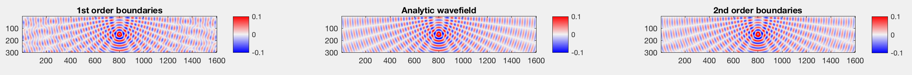

# Fast Helmholtz solver
(c) Vladimir Kazei, Oleg Ovcharenko, Dmitry Kabanov (KAUST, 2019)

**This repository contains MATLAB implementation of the solver for the Helmholtz equation with absorbing boundary conditions (ABCs) and optional free surface**.

## Details

The solver implements 1st and 2nd order ABCs [(Clayton-Enquist, 1977)](https://pubs.geoscienceworld.org/ssa/bssa/article/67/6/1529/117727/absorbing-boundary-conditions-for-acoustic-and)
and 1st order BCs from the [SimpleFWI](https://github.com/TristanvanLeeuwen/SimpleFWI) project.

Figure below compares the numerical solutions obtained using the 1st and 2nd order ABCs with analytic Green's function:


We also add optional free surface to implementations of the boundary conditions of both orders:


The discretized Helmholtz equation is solved with a banded matrix solver, which is the most efficient for shallow and wide models.

## Repository content

```text
Core files
    getA - assemble Helmholtz matrix with 2nd order ABCs (optional free surface)
    getP - project solution to receiver positions
    F    - forward modeling

Reference files:
    getA_1st    - assemble Helmholtz matrix with 1st order ABCs
    getA_1st_FS - assemble Helmholtz matrix with 1st order ABCs and free surface

Misc files:
    defval  - assigns a default value to the named variable
    diags   - construct sparse diagonal matrix
    rdbuMap - custom colormap

Tests
    testHelmholtz    - test on homogeneous model
    testHelmholtz_FS - test on homogeneous model with free surface
```
