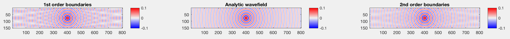

# Fast Helmholtz solver
(c) Vladimir Kazei, Oleg Ovcharenko, Dmitry Kabanov (KAUST, 2019)

**This repository contains implementation of 2nd order absorbing boundary conditions (BC) applied to Helmholtz equation**.

We compare solutions of Helmholtz equation with 1st and 2nd order BC [(Clayton-Enquist, 1977)](https://pubs.geoscienceworld.org/ssa/bssa/article/67/6/1529/117727/absorbing-boundary-conditions-for-acoustic-and) with analytic Green's function. implementation of first order BC is adopted from [SimpleFWI](https://github.com/TristanvanLeeuwen/SimpleFWI).  We also add optional free surface to implementations with boundaries of both orders.

The discretized equation is solved with a banded matrix solver. Which is the most efficient for shallow, wide models.


With free surface


## Repository content
Core files
```
getA - assemble Helmholtz matrix with 2nd order BC (optional free surface)
getP - project solution to receiver positions
F    - forward modeling
```

Reference files
```
getA_1st    - assemble Helmholtz matrix with 1st order BC
getA_1st_FS - assemble Helmholtz matrix with 1st order BC and free surface
```

Misc files
```
defval  - assigns a default value to the named variable
diags   - construct sparse diagonal matrix
rdbuMap - custom colormap
```

Tests
```
testHelmholtz    - test on homogeneous model
testHelmholtz_FS - test on homogeneous model with free surface
```